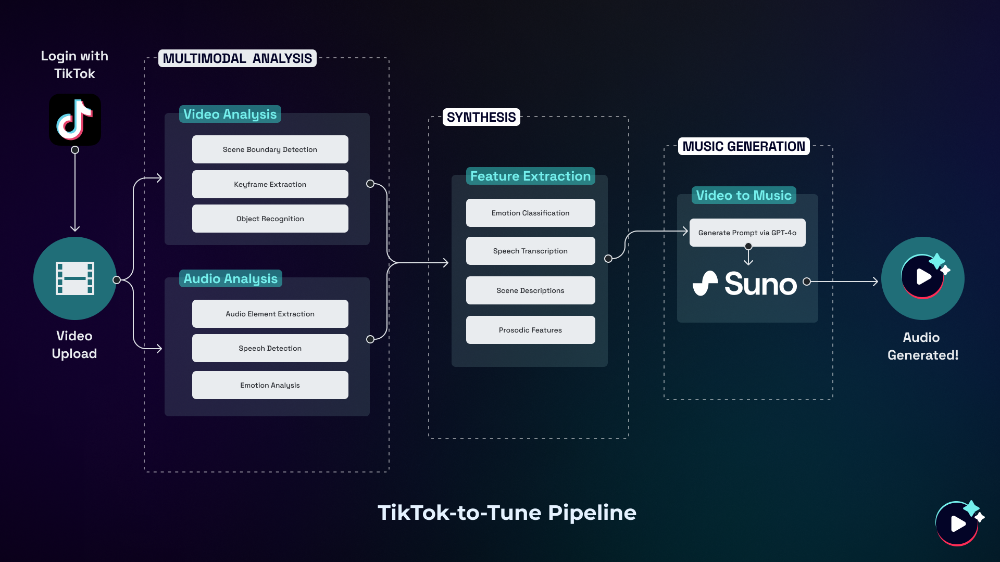

# TuneTok: Tiktok-to-Tune

> Submission for: TikTok TechJam 2024

TuneTok is designed to improve upon TikTok’s existing capabilities by introducing a novel approach to TikTok sounds. With the aid of AI technologies, it leverages a comprehensive multimodal framework that extracts audio and visual modalities from TikToks to transform them into memorable and tailored tunes.

## Background
The rise of short-form content has redefined the way we consume media in just a matter of seconds. Platforms like TikTok have dominated today's digital landscape with over 1 billion monthly active users and 167 million TikToks viewed in an average minute.

But the true magic behind it all lies beyond visuals and swift messages—sound is the real catalyst that drives engagement and success. According to a TikTok and Kantar study, 88% of users report that sound is essential to the TikTok experience.

### The Problem
However, content creators face significant challenges in selecting appropriate and engaging audio content for their videos. These challenges include:

1. Navigating through an overwhelming volume of available sounds.
2. Addressing copyright concerns associated with using existing audio.
3. Spending excessive time searching for the perfect sound that resonates with their audience.

### Inspiration & Solution
Acknowledging these pain points and drawing inspiration from the intuition behind the novel [Video2Music framework designed by Kang et al. (2023)](https://arxiv.org/abs/2311.00968), I decided to build TuneTok to effectively streamline the short-form content creation process.

## How I Built It

### Tech Stack

### Architecture 

#### 1. TikTok Integration and Video Upload
Utilizing TikTok’s API, this integration allows TuneTok to directly access and process TikTok content, ultimately streamlining user experience.

#### 2. Multimodal Analysis
This is the core of TuneTok, which extracts and analyzes both audio and visual modalities from TikToks in parallel. The Multimodal Analysis stage is divided into 2 segments: Video Analysis and Audio Analysis which consists of the following steps:

**Video Analysis**
1. Scene Boundary Detection: Identifies distinct scenes within a TikTok.
2. Keyframe Extraction: Captures representative frames from each scene.
3. Object Recognition: Identifies key elements within each frame.

**Audio Analysis**
1. Audio Element Extraction: Isolates key audio components from a TikTok.
2. Speech Detection: Identifies whether or not there is the presence and content of speech.
3. Emotion Analysis: Assesses the emotional tone of the speech, if detected.

#### 3. Feature Synthesis
Afterwards, TuneTok synthesizes the extracted features in order to create a comprehensive summary and understanding of the video:

1. Emotion Classification: Determines overall emotional context.
2. Speech Transcription: Converts spoken content to text.
3. Scene Description: Generates textual descriptions of visual elements.
4. Prosodic Features: Examines the rhythm and intonation patterns.

#### 4. Music Generation
Leveraging the Suno API, TuneTok transforms the synthesized video summary into a prompt which is then  utilized to create a custom-generated tune. This process ensures that the generated audio aligns closely with the video's content, mood, and rhythm.

#### 5. Audio-Visual Synchronization
The final step involves carefully splicing the original TikTok video with the newly generated tune to create a TikTok with optimal audio-visual synchronization.

## Challenges
- Strategically designing the backend and understanding how each core component interact with each other. 
- Orchestrating API calls, understanding when to effectively make asynchronous calls vs. synchronous calls.
- Learning frontend on the fly (apologies for spaghetti code).
- Building every aspect of the product end-to-end: UX/UI, frontend, and backend.

## Accomplishments I’m Proud Of
- Challenging myself to go solo for this hackathon truly proved to be the biggest challenge, but I learned so much behind both the design and development process. :^) 
- In the end, I was able to make a fully fledged MVP in a short amount of time which I’m ultimately proud of.

## Sources 
https://www.businessofapps.com/data/tik-tok-statistics/  
https://www.socialmediatoday.com/news/tiktok-shares-new-insights-into-the-importance-of-sound-for-marketing-promo/601569/  
https://www.musicbusinessworldwide.com/38-of-tracks-tiktok-100-million/  
https://www.tiktok.com/business/en-US/blog/kantar-report-how-brands-are-making-noise-and-driving-impact-with-sound-on-tiktok?redirected=1&platform=facebook&channel=facebook-organic-post-blog-soundon-44356&attr_source=facebook&attr_medium=organic-post&attr_campaign=facebook-organic-post-blog-soundon-44356
https://arxiv.org/abs/2311.00968
